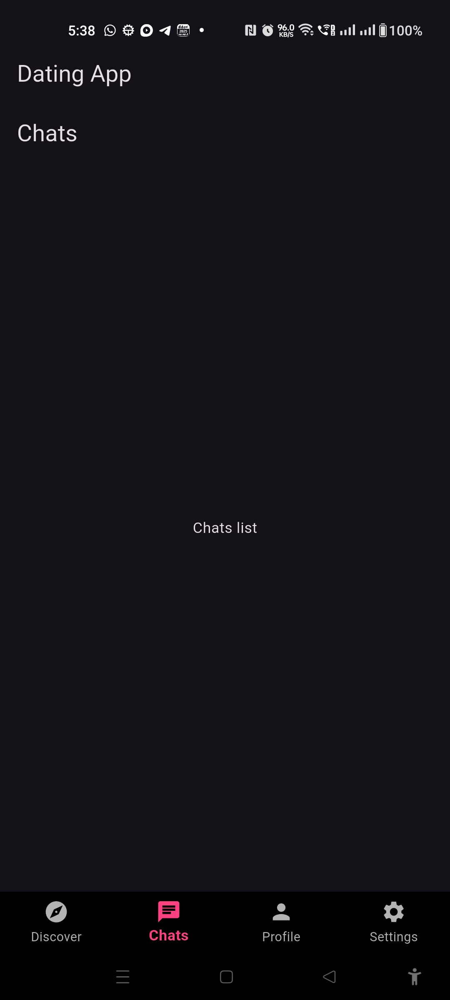
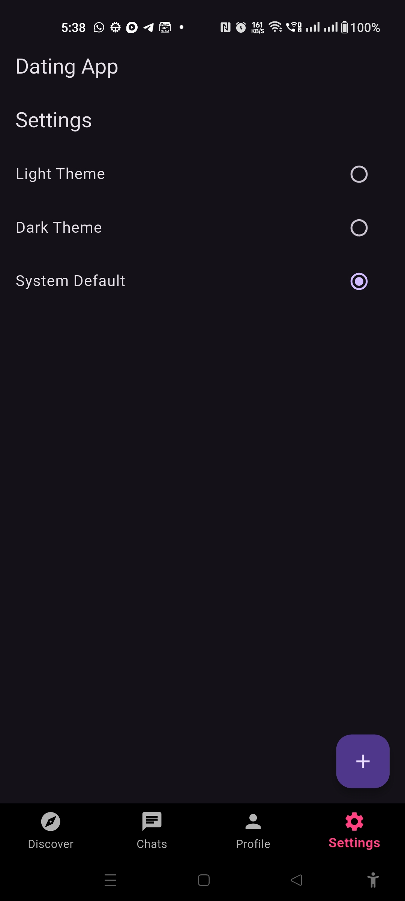
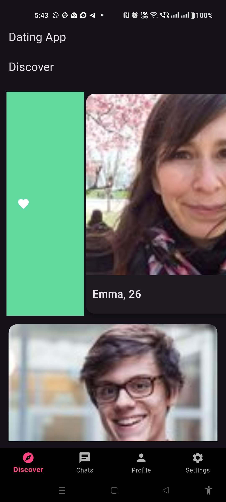
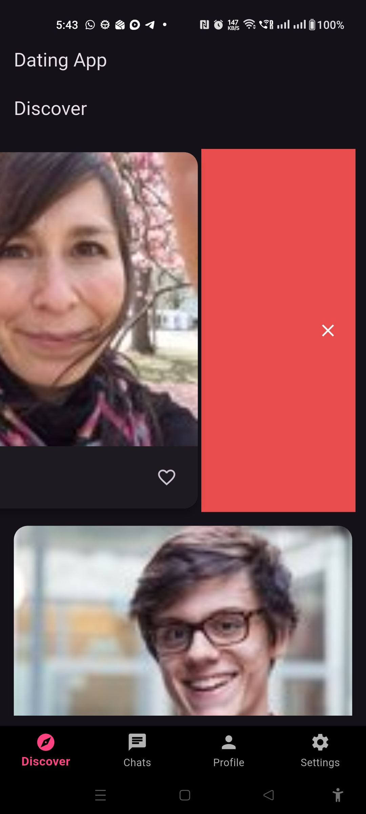

# Flutter Dating App (Swipe + Likes + Matches)

A simple Tinder-style dating app built using Flutter + Firebase + Riverpod v2.

Features:
- Login / Signup (Firebase Auth)
- User Profile storage (Firestore `users` collection)
- Swipe right = Like
- Swipe left = Dislike
- If both users like each other → create “match”
- Theme switching (Light / Dark) using Riverpod
- Bottom Nav: Discover / Chats / Profile / Settings

---

## Project Setup

### 1) Install Flutter
https://docs.flutter.dev/get-started/install

### 2) Clone this repository
```bash
git clone https://github.com/dhinadts/dating_app.git
cd dating_app
flutter pub get
firebase login
firebase projects:create <your_project_name>
flutterfire configure

Generated files must exist:
lib/firebase_options.dart
android/app/google-services.json
ios/Runner/GoogleService-Info.plist
```

## 📱 Screenshots

### Admin Panel
<p align="center">
  
  
  
  
    
  


</p>

---


### Next Steps (future roadmap)

## You should include these points at bottom of README for future dev reference:

add chat system (Firestore subcollection /matches/{matchId}/messages)
show ONLY users not yet liked/disliked (where not in lists)
add real filtering (age range / location)
add pagination instead of limit(50)
store user interests
premium logic (limited swipes / boost)


